# Backend Prisma Schema Overview

> **다루는 범위**: Prisma 모델·관계·enum을 도메인별로 그룹화해 한눈에 보기
> **관련 코드**: [apps/api/prisma/schema.prisma](../apps/api/prisma/schema.prisma)
> **함께 보기**: [backend-auth-flow.md](backend-auth-flow.md)
> **최종 수정**: 2026-05-18

현재 `schema.prisma` (2026-05-18 기준) 모델 45개·enum 27개를 도메인 묶음으로 정리. 모든 모델은 `id String @id @default(uuid()) @db.Uuid` 기본. 본문은 핵심 필드/관계 위주.

---

## 전체 관계도 (ER)

> AI가 모델 관계를 텍스트로 빠르게 파악하기 위한 mermaid ER 다이어그램. 사람용 풍부한 시각화는 외부 다이어그램 도구를 참고. `schema.prisma` 변경 시 함께 갱신할 것.

```mermaid
erDiagram
    %% === 인증·사용자·프로필 ===
    User ||--o| ClientProfile : has
    User ||--o| ExpertProfile : has
    Admin ||--o{ User : "blocks (as admin)"
    Admin ||--o{ ExpertProfile : "approves"

    %% === 카테고리·기술스택 (조인 테이블) ===
    ClientProfile ||--o{ ClientInterestCategory : "interested-in"
    ServiceGroup ||--o{ ClientInterestCategory : "grouped-by"
    ServiceCategory ||--o{ ClientInterestCategory : "categorized-by"

    ExpertProfile ||--o{ ExpertSpecialtyCategory : "specialized-in"
    ServiceGroup ||--o{ ExpertSpecialtyCategory : "grouped-by"
    ServiceCategory ||--o{ ExpertSpecialtyCategory : "categorized-by"

    ExpertProfile ||--o{ ExpertTechStack : "has"
    TechStack ||--o{ ExpertTechStack : "assigned-to"

    %% === 포트폴리오 ===
    ExpertProfile ||--o{ Portfolio : "owns"
    Portfolio ||--o{ PortfolioImage : "has (cascade)"
    Portfolio ||--o{ PortfolioSkill : "has (cascade)"

    %% === 서비스 ===
    User ||--o{ Service : "provides (as expert)"
    ServiceGroup ||--o{ Service : "grouped-by"
    ServiceCategory ||--o{ Service : "categorized-by"
    Service ||--o{ ServiceTechStack : "has (cascade)"
    TechStack ||--o{ ServiceTechStack : "assigned-to"
    Service ||--o{ ServiceImage : "has (cascade)"
    Service ||--o{ ServiceStep : "has (cascade)"
    Service ||--o{ ServiceFaq : "has (cascade)"

    %% === 거래 (Order → Payment → Refund 체인) ===
    User ||--o{ Order : "places (as client)"
    User ||--o{ Order : "fulfills (as expert)"
    Service ||--o{ Order : "ordered"
    Admin ||--o{ Order : "settles (as admin)"
    Order ||--o| Payment : "has"
    User ||--o{ Payment : "pays"
    Payment ||--o| Refund : "may-have"
    User ||--o{ Refund : "claims (as client)"
    User ||--o{ Refund : "receives (as expert)"
    Admin ||--o{ Refund : "approves"
    Order ||--o| Review : "has"
    User ||--o{ Review : "writes"

    %% === 즐겨찾기 / 최근 본 ===
    User ||--o{ FavoriteService : "favorites"
    Service ||--o{ FavoriteService : "favorited-by"
    User ||--o{ FavoriteExpert : "favors (as client)"
    User ||--o{ FavoriteExpert : "favored-by (as expert)"
    User ||--o{ RecentlyViewedService : "viewed"
    Service ||--o{ RecentlyViewedService : "viewed-by"

    %% === 신고 ===
    User ||--o{ Report : "reports (as reporter)"
    User ||--o{ Report : "reported (as reported)"
    Report ||--o{ ReportImage : "has (cascade)"

    %% === 커뮤니티 ===
    User ||--o{ CommunityPost : "writes"
    Admin ||--o{ CommunityPost : "soft-deletes"
    CommunityPost ||--o{ Comment : "has (cascade)"
    User ||--o{ Comment : "writes"
    Admin ||--o{ Comment : "soft-deletes"
    Comment ||--o{ Comment : "replies-to"
    User ||--o{ Like : "likes"
    CommunityPost ||--o{ Like : "liked-by (cascade)"

    %% === 알림 ===
    User ||--o{ Notification : "receives"

    %% === 채팅 (User ↔ User) ===
    User ||--o{ ChatRoom : "as client"
    User ||--o{ ChatRoom : "as expert"
    Service ||--o{ ChatRoom : "current-service"
    ChatRoom ||--o{ ChatParticipant : "has (cascade)"
    User ||--o{ ChatParticipant : "participates-in"
    ChatRoom ||--o{ Message : "contains"
    User ||--o{ Message : "sends"
    Message ||--o{ MessageAttachment : "has (cascade)"

    %% === CS 채팅 (User ↔ Admin) ===
    User ||--o{ CsChatRoom : "opens"
    Admin ||--o{ CsChatRoom : "handles (optional)"
    CsChatRoom ||--o{ CsMessage : "contains"
    User ||--o{ CsMessage : "sends (optional)"
    Admin ||--o{ CsMessage : "sends (optional)"
    CsMessage ||--o{ CsMessageAttachment : "has (cascade)"

    %% === 메인 / 카테고리 추천 ===
    User ||--o{ MainSetting : "featured (as expert)"
    Service ||--o{ MainSetting : "featured"
    ServiceGroup ||--o{ CategoryFeaturedService : "groups"
    Service ||--o{ CategoryFeaturedService : "featured-in"

    %% === 어드민 활동 로그 ===
    Admin ||--o{ AdminActivityLog : "logs"

    %% === 통계 (일별 집계) ===
    User ||--o{ StatisticsBySeller : "daily-stats"
    ServiceGroup ||--o{ StatisticsByCategory : "grouped-by"
    ServiceCategory ||--o{ StatisticsByCategory : "categorized-by"

    %% === 관계 없는 독립 모델 (참고용) ===
    %% Banner, Faq — FK 관계 없음
```



**범례**:
- `||--o|` = 1:0..1 (옵셔널 1:1)
- `||--o{` = 1:0..N
- `(cascade)` = 부모 삭제 시 자식도 삭제 (`onDelete: Cascade`)
- 같은 User가 여러 역할(client/expert) 양방향으로 들어가는 관계는 두 줄로 분리해 표기

**다이어그램에 없는 모델** (관계 없음): `Banner`, `Faq`.

---

## 1. 도메인 그룹

```
인증·사용자        User, Admin
프로필             ClientProfile, ExpertProfile
카테고리·기술스택  TechStack, ServiceGroup, ServiceCategory
                  + 조인: ClientInterestCategory, ExpertSpecialtyCategory, ExpertTechStack
포트폴리오         Portfolio, PortfolioImage, PortfolioSkill
서비스             Service + ServiceTechStack, ServiceImage, ServiceStep, ServiceFaq
리뷰               Review
거래               Order, Payment, Refund
즐겨찾기·최근봄    FavoriteService, FavoriteExpert, RecentlyViewedService
신고               Report, ReportImage
커뮤니티           CommunityPost, Comment, Like
알림               Notification
배너·메인·FAQ      Banner, MainSetting, CategoryFeaturedService, Faq
어드민 활동        AdminActivityLog
채팅               ChatRoom, ChatParticipant, Message, MessageAttachment
CS 채팅            CsChatRoom, CsMessage, CsMessageAttachment
통계               StatisticsBySeller, StatisticsByCategory
```

---

## 2. 인증·사용자

### `User` (가장 중심 모델)
- 핵심: `email @unique`, `password?`, `provider: AuthProvider`, `providerId?`, `role: Role`
- 차단 상태: `isBlocked`, `blockedAt?`, `blockedByAdminId?` → `Admin`
- 탈퇴 상태: `isDeleted`, `deletedAt?`, `deletionReason?`
- 부가: `profileImageUrl?`, `region?`, `bankName?`, `bankAccount?`, `phoneNumber?`
- 제약: `@@unique([provider, providerId])` — 소셜 가입 시 동일 provider+id 중복 방지
- 관계 (수가 많음): clientProfile/expertProfile, services(전문가), reviews, orders(client/expert 양방향), payments, refunds, favoriteServices, favoriteExperts, recentlyViewedServices, sentReports/receivedReports, mainSettings, communityPosts, comments, likes, chatRooms, messages, notifications, statisticsBySeller, blockedByAdmin

### `Admin`
- 분리된 별도 테이블. `User`와 관계 없음 (관리자는 별도 인증)
- 핵심: `isSuper`, `mustChangePassword` (기본 true — 첫 로그인 시 강제 변경 의도), `lastLoginAt?`
- 관계: `csChatRooms`(담당), `sentCsMessages`, `approvedRefunds`, `settledOrders`, `communityPosts`(어드민 작성/삭제), `expertApprovals`, `blockedUsers`, `activityLogs`, `deletedComments`

---

## 3. 프로필

### `ClientProfile` (User 1:1)
- `userId @unique`
- `nickname?`
- `interestCategories: ClientInterestCategory[]`

### `ExpertProfile` (User 1:1)
- `userId @unique`
- 신청·승인: `isApplied`, `isApproved`, `approvedAt?`, `approvedByAdminId?` → `Admin`, `rejectedAt?`, `rejectReason?`
- 사업자 정보: `businessName?`, `businessNumber?`, `ceoName?`, `contactTimeStart?`, `contactTimeEnd?`, `foundedYear?`, `employeeMin?`, `employeeMax?`
- 평점 집계: `avgRating?`, `reviewCount @default(0)`
- 관계: `specialtyCategories`, `techStacks`, `portfolios`, `approvedByAdmin?`

---

## 4. 카테고리·기술스택 (마스터 테이블 + 조인)

### 마스터 (각각 enum 1:1)
- `TechStack` — `name: TechStackName @unique`
- `ServiceGroup` — `name: ServiceGroupName @unique` (IT_COACHING / PROJECT_REQUEST 2개)
- `ServiceCategory` — `name: ServiceCategoryName @unique` (WEB/APP/AI/GAME/DATA_ANALYTICS 5개)

### 조인 (다대다 + 추가 컬럼)
- `ClientInterestCategory` — `(clientProfileId, serviceGroupId, serviceCategoryId) @@unique`
- `ExpertSpecialtyCategory` — `(expertProfileId, serviceGroupId, serviceCategoryId) @@unique`
- `ExpertTechStack` — `(expertProfileId, techStackId) @@unique`

---

## 5. 포트폴리오

### `Portfolio` (ExpertProfile 1:N)
- 핵심: `title`, `description`, `clientName`, `businessSector: BusinessSector`
- 시간: `createdAt`, `updatedAt`
- 관계: `images: PortfolioImage[]`, `skills: PortfolioSkill[]`

### `PortfolioImage` (Portfolio 1:N, **onDelete: Cascade**)
- `imgUrl`, `isMain @default(false)`

### `PortfolioSkill` (Portfolio 1:N, **onDelete: Cascade**)
- `stackName: String`, `stackType: StackType` (DESIGN/FRONTEND/BACKEND)
- ⚠️ `stackName`은 `TechStack` 테이블 참조가 아니라 자유 입력 String

---

## 6. 서비스

### `Service` (전문가 User 1:N)
- 핵심: `title`, `workDuration`(기간 일수), `revisionCount`, `serviceScope`, `servicePrice`, `description`, `refundPolicy`
- 부가: `preparationNotes?`
- 분류: `serviceGroupId`, `serviceCategoryId`
- 상태: `status: ServiceStatus` (ACTIVE/PAUSED/CLOSED)
- 시간: `createdAt`, `updatedAt`
- 관계: `techStacks`, `images`, `steps`, `faqs`, `orders`, `favoriteServices`, `chatRooms`, `recentlyViewedBy`, `mainSettings`, `featuredIn` (CategoryFeaturedService)
- 외래키: `expertUserId` → `User` via `@relation("ExpertServices")`

### 자식 모델 (모두 **onDelete: Cascade**)
- `ServiceTechStack` — `(serviceId, techStackId) @@unique`
- `ServiceImage` — `imgUrl`, `isMain`
- `ServiceStep` — `(serviceId, order) @@unique` (순서 보장)
- `ServiceFaq` — `question`, `answer`, `createdAt`

---

## 7. 리뷰

### `Review` (Order 1:1)
- `orderId @unique` — 주문당 리뷰 1개
- `userId` — 작성자(클라이언트)
- `rating: Int`, `content: String`

---

## 8. 거래 (Order → Payment → Refund 체인)

### `Order`
- 양 당사자: `clientUserId`, `expertUserId` (둘 다 User)
- 대상: `serviceId`
- 금액: `agreedServicePrice`, `platformFee`, `totalAmount`
- 일정: `startDate`, `endDate`, `confirmedAt?`
- 상태: `status: OrderStatus` (12가지 — NEGOTIATING ~ REFUND_COMPLETED, 전체 라이프사이클)
- 환불: `refundReason?`
- 정산: `settledAt?`, `settledByAdminId?` → `Admin`
- 관계: `payment: Payment?`, `review: Review?`, `settledByAdmin?`

### `Payment` (Order 1:1)
- `orderId @unique`
- 금액: `paidAmount`
- 결제 방식: `method: String`, `installmentMonths @default(1)` (1=일시불, 2+ = 할부 개월 수)
- 상태: `status: PaymentStatus` (PENDING/PAID/FAILED/CANCELLED/REFUNDED)
- 외부 PG: `paymentKey? @unique`, `rawData: Json?` (PG 원본 응답 저장)
- 시간: `createdAt`, `approvedAt?`
- 관계: `refund: Refund?`

### `Refund` (Payment 1:1)
- `paymentId @unique`
- 양 당사자: `clientUserId`, `expertUserId`
- 분류: `type: RefundType` (CANCEL: 작업 전 취소 / REFUND: 기한 만료)
- 상태: `status: RefundStatus` (REQUESTED/APPROVED/REJECTED/COMPLETED)
- 사유: `adminReason?` (어드민이 승인/반려 시 남기는 메모)
- 승인자: `approvedAdminId?` → `Admin`
- 시간: `requestedAt`, `approvedAt?`, `refundedAt?`
- PG: `paymentKey? @unique`, `rawData: Json?`

---

## 9. 즐겨찾기·최근 본

### `FavoriteService` — `(clientUserId, serviceId) @@unique`
### `FavoriteExpert` — `(clientUserId, expertUserId) @@unique`
### `RecentlyViewedService` — `(clientUserId, serviceId) @@unique`, `viewedAt`
- 같은 서비스를 다시 보면 row 추가가 아니라 `viewedAt` 갱신 의도 (upsert)

---

## 10. 신고

### `Report`
- 양 당사자: `reporterId` (신고자), `reportedId` (피신고자) — 둘 다 User self-relation
- 사유: `reason: ReportReason` (FALSE_INFORMATION/ABUSE/ILLEGAL_ACTIVITY/EXTERNAL_CONTACT/SPAM/OTHER)
- 처리 상태: `status: ReportStatus @default(PENDING)` (PENDING/COMPLETED)
- 내용: `detail: String`
- 관계: `reporter`, `reported`, `images: ReportImage[]`

### `ReportImage` (Report 1:N, **onDelete: Cascade**)
- `imageUrl`

---

## 11. 커뮤니티

### `CommunityPost`
- `userId` (작성자)
- 분류: `category: CommunityCategory` (QUESTION/TIP/REVIEW/STUDY_GROUP/FREE)
- 내용: `title`, `content`
- 어드민 삭제: `deletedAt?`, `deleteReason?`, `deletedByAdminId?` → `Admin`
- 관계: `comments`, `likeRecords`

### `Comment` (CommunityPost 1:N, **onDelete: Cascade**)
- `parentCommentId?` — 대댓글 (self-relation `CommentReplies`, parent 삭제 시 cascade)
- `userId`, `content`
- 어드민 삭제: `deletedAt?`, `deletedByAdminId?` → `Admin`

### `Like`
- `(userId, postId) @@unique` — 중복 좋아요 방지
- post 삭제 시 cascade

---

## 12. 알림

### `Notification`
- `userId` (수신자)
- 분류: `type: NotificationType` (COMMUNITY/TRANSACTION/REMINDER), `category: NotificationCategory` (세부 15종)
- 본문: `content: String`
- 참조: `referenceType: ReferenceType` (SERVICE/ORDER/POST/COMMENT/PAYMENT/REFUND), `referenceId: Uuid` — 다형 참조 (FK 아님, 클라이언트가 라우팅 판단)
- 상태: `isRead @default(false)`
- 테이블 명: `moveit_notifications` (다른 모델은 `users`, `orders` 등 단순 복수형인데 이건 prefix 있음)

---

## 13. 배너·메인·FAQ·카테고리 추천

### `Banner` — `imageUrl`, `actionUrl` (단순 슬라이드 배너)
### `MainSetting` — 메인 페이지 섹션 큐레이션
- `sectionType: MainSectionType` (POPULAR_IT_COACHING 등 6가지)
- `targetType: MainTargetType` (USER/SERVICE)
- `targetUserId?` 또는 `targetServiceId?` — 둘 중 하나만 사용 (FK 관계 있음)
### `CategoryFeaturedService` — 카테고리별 추천 서비스
- `(serviceGroupId, serviceId) @@unique` — ServiceGroup별로 노출되는 추천 서비스 모음
- ServiceGroup, Service 모두 FK 관계
### `Faq` — `title`, `content`

---

## 14. 어드민 활동 로그

### `AdminActivityLog`
- `adminId` (작성한 Admin)
- `actionType: AdminActionType` (EXPERT_APPROVED, FAQ_CREATED 등 12종)
- `referenceId?: Uuid` — 행위 대상 ID (다형 참조, FK 아님 — 액션 타입에 따라 다른 테이블 참조)
- `createdAt`

---

## 15. 채팅 (사용자 ↔ 전문가)

### `ChatRoom`
- 핵심: `clientUserId`, `expertUserId`, `currentServiceId`
- 마지막 메시지 캐시: `lastMessageId?` → `Message` (목록 정렬용)
- 제약: `@@unique([clientUserId, expertUserId])` — 두 사람당 방 1개
- 관계: `participants`, `messages`, `lastMessage`

### `ChatParticipant`
- `(chatRoomId, userId) @@unique`
- 안읽음 추적: `lastReadMessageId?`
- room 삭제 시 cascade

### `Message`
- 핵심: `chatRoomId`, `senderId`, `content`
- 분류: `type: MessageType` (TEXT/FILE/SYSTEM)
- 시스템 메시지: `systemType?: SystemMessageType` (거래 요청/결제/일정 등 10가지)
- 다형 참조: `referenceType?: MessageReferenceType` (ORDER/PAYMENT), `referenceId?`
- 관계: `attachments: MessageAttachment[]`, `chatRoomAsLast` (ChatRoom의 lastMessage 역참조)

### `MessageAttachment` (Message 1:N, **onDelete: Cascade**)
- `fileUrl`, `fileName`, `fileType`, `fileSize`

---

## 16. CS 채팅 (사용자 ↔ 어드민)

채팅과 거의 동형이지만 발신자가 User/Admin 둘 다 가능.

### `CsChatRoom`
- `userId` (User), `assignedAdminId?` (배정된 Admin)
- `status: CsChatStatus` (OPEN/ASSIGNED/CLOSED)
- `lastMessageId?` 캐시

### `CsMessage`
- `senderType: SenderType` (USER/ADMIN)
- `senderUserId?` 또는 `senderAdminId?` (type에 따라 한쪽만)
- `content`, `type: MessageType`

### `CsMessageAttachment` — Message 첨부와 동일 구조 (Cascade)

---

## 17. 통계 (일별 집계)

### `StatisticsBySeller`
- `(sellerUserId, date) @@unique` — 전문가별 + 날짜별 1행 (일별 누적)
- `date: Date`
- `totalTransactionAmount`, `totalTransactionCount`, `maxTransactionAmount` (모두 `@default(0)`)
- 실시간 계산 비용을 피하기 위한 캐시. 거래 발생 시 업데이트 필요(현재 코드엔 갱신 로직 미구현).

### `StatisticsByCategory`
- `(serviceGroupId, serviceCategoryId, date) @@unique` — 카테고리별 + 날짜별 1행
- 동일 집계 필드 (모두 `@default(0)`)

---

## 18. Enum 카탈로그

| Enum | 값 (요약) | 용도 |
|---|---|---|
| `AuthProvider` | LOCAL, GOOGLE, KAKAO, NAVER | User.provider |
| `Role` | CLIENT, EXPERT | User.role (Admin은 별도 테이블) |
| `Region` | 18개 (서울~제주) | User.region |
| `TechStackName` | 20개 (JS/TS/Python/...) | TechStack.name |
| `ServiceGroupName` | IT_COACHING, PROJECT_REQUEST | 서비스 대분류 |
| `ServiceCategoryName` | WEB, APP, AI, GAME, DATA_ANALYTICS | 서비스 소분류 |
| `BusinessSector` | 5개 (공공/이커머스/법률/부동산/의료) | Portfolio.businessSector |
| `StackType` | DESIGN, FRONTEND, BACKEND | PortfolioSkill.stackType |
| `ServiceStatus` | ACTIVE, PAUSED, CLOSED | Service.status |
| `OrderStatus` | 12개 (NEGOTIATING ~ REFUND_COMPLETED) | Order 라이프사이클 |
| `PaymentStatus` | PENDING, PAID, FAILED, CANCELLED, REFUNDED | Payment.status |
| `RefundType` | CANCEL, REFUND | Refund.type |
| `RefundStatus` | REQUESTED, APPROVED, REJECTED, COMPLETED | Refund.status |
| `CommunityCategory` | QUESTION, TIP, REVIEW, STUDY_GROUP, FREE | 커뮤니티 분류 |
| `NotificationType` | COMMUNITY, TRANSACTION, REMINDER | 알림 대분류 |
| `NotificationCategory` | 15개 (POST_COMMENT, ORDER_CREATED 등) | 알림 세부 |
| `ReferenceType` | SERVICE, ORDER, POST, COMMENT, PAYMENT, REFUND | Notification 다형 참조 |
| `MainSectionType` | 6개 (POPULAR_IT_COACHING, MOVEIT_POPULAR_*, RECOMMENDED_* 등) | MainSetting 섹션 종류 |
| `MainTargetType` | USER, SERVICE | MainSetting 타겟 |
| `MessageType` | TEXT, FILE, SYSTEM | Message 종류 |
| `SystemMessageType` | 10개 (TRADE_REQUEST_SENT 등) | 시스템 메시지 종류 |
| `SenderType` | USER, ADMIN | CsMessage 발신자 |
| `CsChatStatus` | OPEN, ASSIGNED, CLOSED | CsChatRoom.status |
| `MessageReferenceType` | ORDER, PAYMENT | Message 다형 참조 |
| `AdminActionType` | 12개 (EXPERT_APPROVED, FAQ_CREATED, BLACKLIST_ADDED 등) | AdminActivityLog.actionType |
| `ReportReason` | 6개 (FALSE_INFORMATION, ABUSE, ILLEGAL_ACTIVITY, EXTERNAL_CONTACT, SPAM, OTHER) | Report.reason |
| `ReportStatus` | PENDING, COMPLETED | Report.status |

---

## 19. 마이그레이션 히스토리

[apps/api/prisma/migrations/](../apps/api/prisma/migrations/)에 7개:

1. `20260511025155_init` — 초기 스키마
2. `20260511082336_add_admin_last_login_at`
3. `20260511082800_add_admin_must_change_password`
4. `20260511083229_add_user_admin_created_at`
5. `20260511090133_add_audit_and_stats_columns`
6. `20260511100532_add_constraints_and_relations`
7. `20260515043056_add_recently_viewed_service` (가장 최근)

스키마 수정 시 `pnpm --filter api run prisma:migrate`로 마이그레이션 함께 생성.

---

## 20. 패턴 메모

- 모든 모델: `id String @id @default(uuid()) @db.Uuid`
- DB 컬럼명: `@map("snake_case")` 일관 적용, 테이블명도 `@@map` 사용
- 자식 모델은 대부분 `onDelete: Cascade` (포트폴리오 이미지/스킬, 서비스 자식, 채팅 첨부, 댓글, 좋아요, 신고 이미지)
- `lastMessageId` 캐시 패턴: ChatRoom·CsChatRoom 모두 마지막 메시지 ID를 자기 자신에 저장 (목록 정렬 N+1 회피)
- 다형 참조: `referenceType` + `referenceId` 쌍 (Notification, Message), `referenceId?` (AdminActivityLog) — Prisma FK가 아니라 애플리케이션 레벨 라우팅용
- 일별 통계 모델은 `date: Date` + 복합 유니크 키로 일별 누적 row 보관
